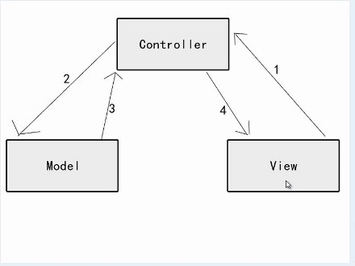
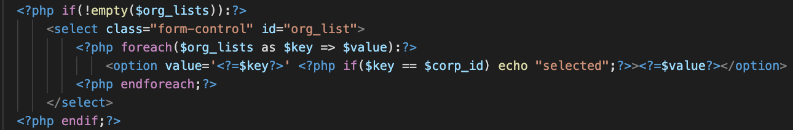
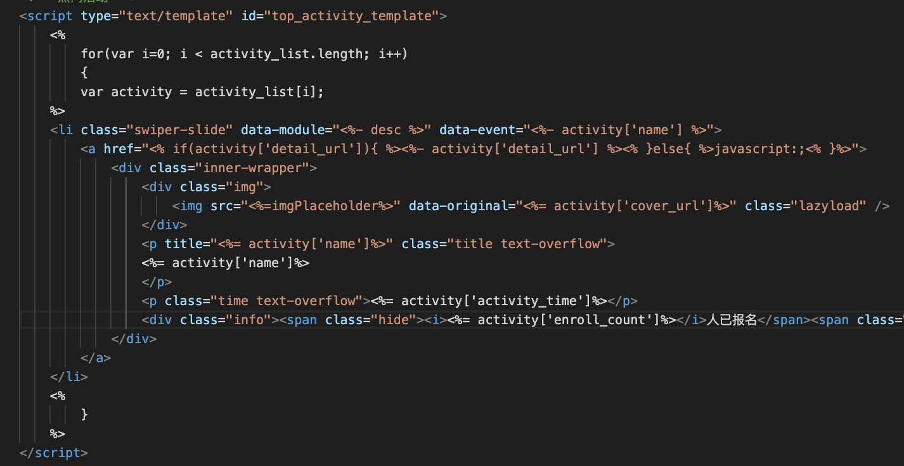
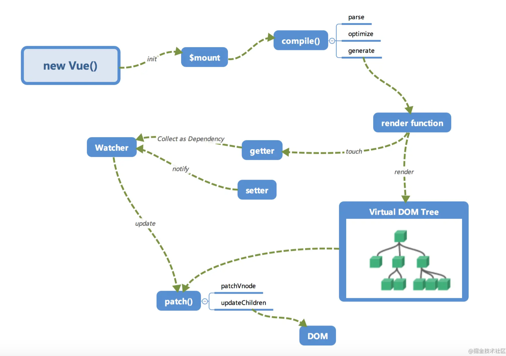
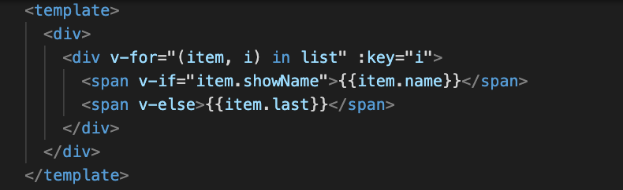

## 什么是指令？

在vue中提供了一些对于页面 + 数据的更为方便的输出，以 v-xxx表示，这些操作就叫做指令

**本质：操作dom节点和绑定 dom 事件，然后进行视图更新或者交互需要，也常用于 ui 组件库**

## 怎样使用指令？

内置指令简单指令:
`v-if`

`v-show`

`v-for`

`v-text`

`v-html`

`v-pre`

`v-once`

动态参数指令:

`v-model -> v-model.trim=“content"`

`v-bind -> v-bind:class=“{active: true}"`

`v-on:click -> v-on:click=“handleClick"`

`v-slot -> v-slot:header`

## 为什么要有指令？

优点：学习成本低，大量内置指令

缺点：模版中只能使用指令，有一定局限性处理复杂的业务逻辑，繁琐且可读性差（Template vs jsx）

### Template历史

#### Web1.0

**后端模版(asp/php/jsp)**

后端的 MVC：M 处理业务逻辑，C 处理前端参数/数据检验/返回数据，V 指后端模版MVC 



**后端模版**



#### Web2.0

Ajax 给前端开发带来了一次质的飞跃，拥有处理数据能力（保存数据，处理数据，生成视图），有力推动了前后端分离，为后续 spa (前端路由)铺平了路，前端工程师的角色也在那时正式确立，Js 操作 dom 逐渐多了起来，由于 IE678 的兼容性，前端开启造轮子，Jquery 脱引而出，那时更多的是全栈，按照后端思维，只想拿到页面数据提交上去，操作 dom 方便即可，也不需要考虑什么交互问题

**Jquery 模版**



#### 前端的 mv* 时代（backone/angular/vue）

以 Vue 为例子，先看看一张实例化 Vue 的整体流程

new Vue: 初始化操作，包括data, prop,method,computed,watch,生命周期,事件等等;

**compile:** 

1. Parse:会用正则等方式解析 template 模板中的指令,class,style等数据，形成AST
2. Optimize: 静态节点的优化，v-once/v-pre 也是优化的一个点，后面更新界面，patch 过程会有 diff 算法，会跳过静态节点，减少比较过程，优化性能
3. Generate: 将 ast 转换为 render function 过程

**响应式：**
通过 Object.defineProperty 的 setter 和 getter

1. **getter**：在 compile 解析的时候，会触发数据的 getter 方法，进行依赖收集（闭包方式），把 watcher 收集起来
2. **setter**：通过之前依赖收集得到的 watcher，触发watcher 的 update 方法，update 方法去更新视图（有 patch 的对比过程）


**数据驱动的开发模式：分离关注点，只专注业务开发**



**Vue 模版**



**Template vs Jsx**

个人认为，纯表现类或者逻辑简单的组件，使用 Template，反之使用 Jsx

**自定义指令案例：**

v-lazyload：懒加载-给dom绑定 scroll 的事件，操作 dom 属性

v-watermarker：页面水印-给 dom 节点加样式

v-draggable：拖拽-给dom绑定移入移出的事件，操作dom样式

v-filter.input: 输入框值的过滤-给dom绑定 input 事件，修改输入框的值

Element-ui 源码的指令使用以 v-loading 为例子，讲讲源码 `element/packages/loading/src/directive.js`

```
<div v-loading.body.lock=“loading” element-loading-text="拼命加载中” element-loading-background=“#fff"></div>
```